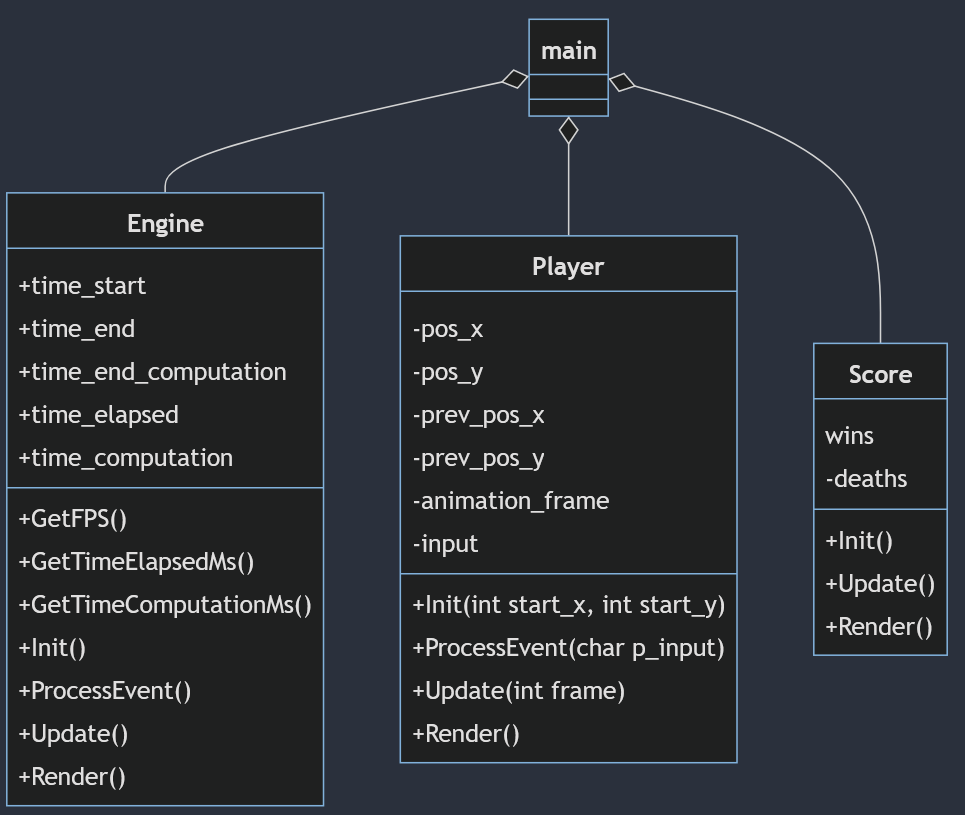
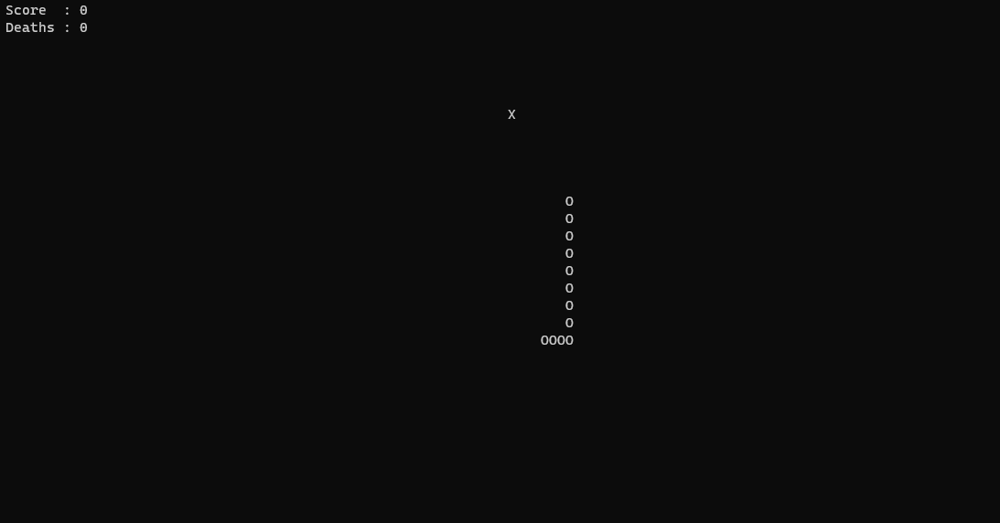

<!--  This is a markdown document. You can read it as-is, or see a pretty rendering opening it through most IDEs -->

# Excercise 2

Objectives
- improve on last week's work
- get familiar with classes and lists
- implement a new game

### Basics: Structure Cleanup

Restructure your code from last week.
1. Create a new project in your favourite IDE
1. Copy the code from last week's exercise and modify it.
    1. Collect all the data relative to Engine, Player and Score and move the to their own structs.
    1. Is the code still compiling? Are there any problems?
    1. How can you tell the compiler to use your other files?
    1. Lanes from Frogger can be dropped, we won't need them for today
1. Convert the struct to classes and have every class implement their own `Init()`, `ProcessEvents`, `Update` and `Render`
    1. The different classes will need to access some data from the others, how can we do this?

Notable bits:
- While implementing, you may see quite a few pieces of code here and there that are very similar or straight-up copy-paste between different classes.
  Of course this is not good practice, but it's definitely good news!
  It means there are some structures and similarities that we can exploit to make our code more generic, and recycle it between games
  (sounds almost like a game engine)
- Now that we are splitting our code between multiple files, compiling is starting to become a bit of a pain.
  This is only gonna get worse, so we will need to find a solution next week.
### Advenced: Snake

Implement a console version of Snake.
1. Updated control scheme
    1. the snake keeps moving in the direction of the last pressed input
    1. you want to control how fast it moves
1. Collectibles
    1. spawn at random coordinates, restricted to the central area of the screen
      (check `ITUGames::Console::GetTerminalWidth()` and `ITUGames::Console::GetTerminalWheight()`
    1. when the snake overlaps a collectible, the collectible is moved to a different position
1. Snake growth
    1. every time the snake overlaps a collectible, its length is increased by 1
    1. the head is already moving correctly, every other element will need to be moved to the position of the precedent element
    1. you will need a list to store the positions of all the various elements
1. Death
    1. if the snake head is overlapping the body, os game over

Tips and tricks
- Encapsulating the logic of each single element in its own class helps a lot keep the code tidy an clean, but you don't need to follow it as a dogma.
  If something requires a lot of pieces to talk to each other, just keep it in the appropriate place in `main.cpp`.
  We will need more tools to address this problem appropriately.
- Testing anything regarding, or that requires, a long snake can be very frustrating if you have to actually play the game as intented.
  But you can cheat: just make it so the snake starts with a fixed lenght, or bind the growth method to a key.
  You can check the numerical code of a certain key googling "ANSI character table".
- Storing a direction can be very tricky. A handy trick is to save it as the offset from (0, 0).
  For example, `UP` would be `dir_x = 0; dir_y = -1` and `RIGHT` would be `dir_x = 1; dir_y = 0`.
  This way, as long as you set the desired direction accordingly, moving in the desired direction becomes simply `pos_x += dir_x; pos_y += dir_y`.

### Challenge: Towards a Proper Engine
Over the course of the next few lectures, we'll address some problems regarding the current approach to make it more flexible and scalable.

- What do you think are the biggest problems of this current solution?
- How would you solve them?
