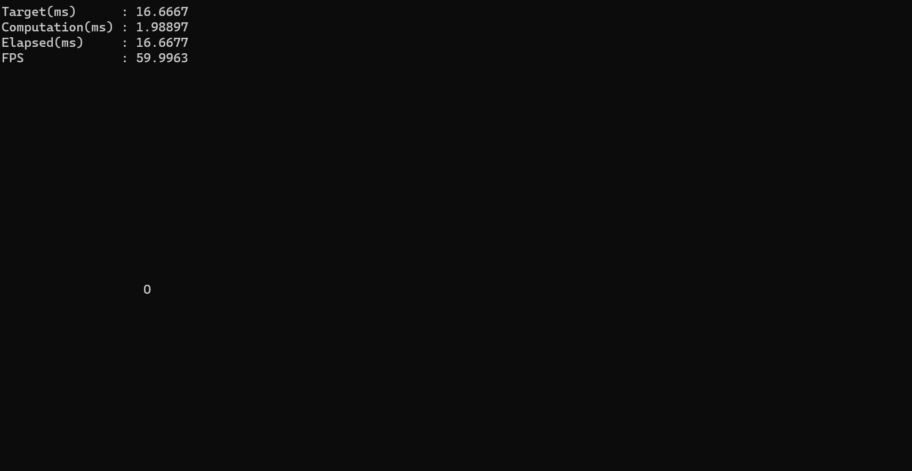
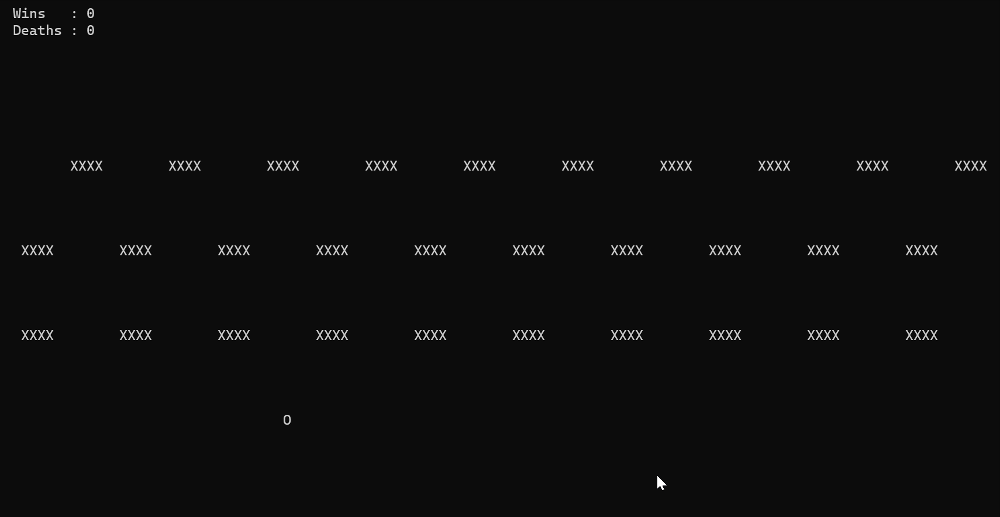

<!--  This is a markdown document. You can read it as-is, or see a pretty rendering opening it through most IDEs -->

# Exercise 1

Sections
- [Early exercises setup](#Early-exercises-setup)
- [Exercise 1](#Exercise-1)
- [C++ Intro resources (check these out if you are not very familiar with C++)](#c-intro-resources)

Objectives
- get familiar with basic C++ syntax, operators and flow control
- implement a simple, console-based game


## Early exercises setup
For the first few exercises we won't need a full-fledged development environment, so we get a more lightweigh setup that everyone can follow.
If you are using Unix or Mac you can follow this guide as-is, while if you are on Windows you will need a couple of extra steps.

Some of the console commands will be prefixed by `[wsl]`, that means that if you are on Wndows you will need to prefix the command with `wsl`, otherwise just omit it. For example:
```bash
[wsl] apt-get install SuperCoolFeature  # downloads and install a package 
```
- on Unix/Mac: `apt-get install SuperCoolFeature`
- on Windows: `wsl apt-get install SuperCoolFeature`


### Extra steps for Windows
Install Unix-system emulator (shipped with windows, should work out of the box)
1. quick setup: type on your terminal (you must start it with admin privileges) `wsl --install` and then restart your computer
1. detailed instructions: [Install Linux on Windows with WSL](https://learn.microsoft.com/en-us/windows/wsl/install)
1. install verification: type in terminal `wsl apt-get moo`

It the command finishes without any errors, you are good to go.

**Notable bits:**
- some of the wsl commands may take a few seconds the first time you run them while Windows is booting Unix and moving files left and right under the hood
- when running a command prefixed with `wsl`, be careful about the paths. The separator must be `/` (but your terminal may automatically insert the wrong one if you autocomplete a path)

### Install C++ compiler
```bash
[wsl] apt-get update
[wsl] apt-get install build-essentials gdb
      cd Exercise1.1
[wsl] g++ -std=c++11 main.cpp
[wsl] ./a.out
```

### Running the exercises
C++ gets periodically updated, so for this class we picked the C++11 standard, which is a good compromise between support and modern features for our purposes. Most installations of the g++, the compiler we are using, will use it as default, but to be all on the same page we will specify it explicitely when running the compilation process.
```bash
[wsl] g++ -std=c++11 main.cpp
[wsl] ./a.out
```

## Exercise 1

Werify that you are correctly setup:
1. Install the g++ compiler
1. Compile the called `hello.cpp`
1. Run the program

### Basics: Game Loops

Build upon the code provided in `main.cpp`
1. Modify the code to implement a simple loop (see slides)
    1. Make the elapsed time log always be printed in the top-left corner (checkout `ITUGames::Console::GotoCoords(int x, int y)` and `ITUGames::Console::GotoTop()`)
    1. Loop the current "expensive computation" and time each iteration
1. Implement a simple "character" controller (to avoid ambiguity, we will use "character" to denote a number/letter/special on console, while our Player Character will be called "Zero")
    **Hint: try to split the implementation in `ProcessEvents()`, `Update()` and `Render()` as shown in the slides.**
    1. Spawn: render Zero at the coordinates (20, 10) using the character `0`
    1. Animate: periodically change the character used to represent Zero between `0` and `O` (around half a second should do)
    1. Control: update Zero's coordinates according to WASD or arrow keys input (checkout `ITUGames::Console::GetCharacter(bool bBlocking)` and "Input key Codes", also in the `ITUGames::Console` namespace)
    1. How does it feel? Which problems does it have? How would you solve them? (spoiler, check next bit of this exercise)
1. Modify the code to implement a fixed step loop
    1. Log additional information:
        1. FPS (Frames Per Second)
        1. Frame Time (how much time passed between the start and the end of the frame
        1. Computation Time (how much time was used to do the actual work, before sleeping)
        1. Target Frame Time (how long you actually wanted your loop iteration to be)
        1. Target FPS (how many loop iterations you wanted in a second)
    1. Add `LongComputation()` to simulate how additional and/or warying work influences the loop. How does it feel? Which problems does it have?
1. Modify the code to implement a fluid step loop
    1. can you see any differences? Which one would you use for this kind of game?


Notable bits:
- In `LongComputation()` and when we print the Frames Per Second (FPS) we use `1000.0` instead of `1000`, this is important! What happens if we use `1000`? Why?

### Advanced: Froggers

Implement a console version of [Frogger](https://en.wikipedia.org/wiki/Frogger#Gameplay). A few things you could consider:
- How to group and organize the state of existing and new gameplay elements? Dumping all of them in global space will be hard to manage
- The timing info is handy but it takes a lot of screen space. Making it toggable is easy, but it requires a bit of care (and a couple of changes) to avoid it interfering with the rendering of gameplay elements.

Notable bits:
- Storing the game and engine states in global space is convenient on small exercises, but it creates A LOT of problems as soon as the project becomes just a little bigger. In future lectures we will address this little by little. How would you do it?
- Take a look at the implementation of `ITUGames::Utils::PreciseSleep()`. Why aren't we using other kinds of sleep? What happens if we use `sleep()/Sleep()` or `std::this_thread::sleep_for()`?

### Challenge: a better console renderer
Render a character at the same coordinates more than one time per frame will make it flicker (clearing counts too!), which looks very ugly.
We could make special cases for each element, preventing every over-draw occurrence one by one, but that's cumbersome and doesn't scale.

To solve this, we need to rethink our approach to console rendering.

Requirements:
- an API that allows us to write characters and string at certain coordinates on the screen as much as we want, without overdraw.
- a way to decide which one, of the multiple requests for writing at coordinate <x, y>, should we pick
- some low-level code that writes all the correct characters/strings in the correct place

## C++ Intro resources
- [Tutorial](https://www.w3schools.com/cpp/cpp_intro.asp)
- [Examples](https://www.w3schools.com/cpp/cpp_examples.asp)
- [Exercises](https://www.w3resource.com/cpp-exercises/)
